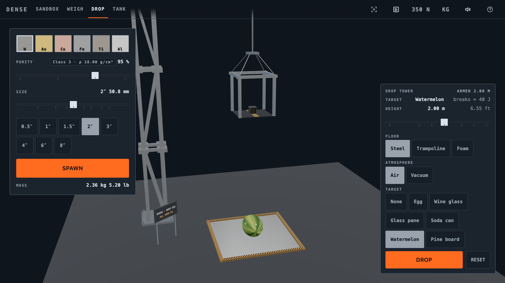

<div align="center">


# Dense

**A browser toy with dense metal cubes**

[](LICENSE)
[](https://threejs.org)
[](https://rapier.rs)
[](https://www.typescriptlang.org)
[](#testing)

**[Live site →](https://dense-tungsten-cubes.pages.dev)**



</div>

---

In late 2021, crypto Twitter decided tungsten cubes were the thing. Midwest Tungsten
Service sold out. Their sales jumped somewhere between 300% and 700% depending on who
you read. Someone sold a 14.5-inch, one-ton cube as an NFT for about $250,000, and the
deal came with quarterly visitation rights to look at the cube, four
times a year.

This is a toy for playing around with tungsten and other metal cubes.

## Modes

**Sandbox.** Drop cubes on different surfaces and pick them back up. Load the preset
that lines up six cubes of equal weight.

**Weigh.** A digital scale and a two-pan balance. 

**Drop.** Winch a cube up the tower and let it go. Pick the floor and what sits
underneath: egg, wine glass, watermelon, soda can, or pine board. Energy at impact decides if they break.

**Tank.** Water, honey or mercury. Mercury floats aluminium, titanium, iron and copper
at different depths while gold and tungsten sink, and gold sinks faster.

## Running it

Node 22 and pnpm.

```bash
corepack enable
pnpm install
pnpm dev
```

Each mode has its own address — `/`, `/weigh`, `/drop`, `/tank` — so you can link
straight to one.

## Testing

521 checks in three groups.

|                     |                                                     |
| ------------------- | --------------------------------------------------- |
| `pnpm test`         | 201 unit tests — maths, formatting, state machines  |
| `pnpm test:physics` | 244 against the real physics engine, nothing mocked |
| `pnpm smoke`        | 76 in a browser, across desktop, tablet and phone   |

## Controls

**Mouse**

|                             |                        |
| --------------------------- | ---------------------- |
| Drag a cube                 | Pick it up and move it |
| Drag the background         | Orbit the camera       |
| Scroll                      | Zoom in and out        |
| Press and hold on the floor | Drop a new cube there  |

**Touch**

|               |                              |
| ------------- | ---------------------------- |
| One finger    | Orbit                        |
| Two fingers   | Pinch to zoom, twist to turn |
| Three fingers | Pan                          |

**Keys**

|         |                          |
| ------- | ------------------------ |
| `Space` | Spawn a cube             |
| `1`–`6` | Pick the metal           |
| `G`     | Cycle grip strength      |
| `F`     | Reset the camera         |
| `R`     | Clear the lab            |
| `U`     | Switch between kg and lb |
| `?`     | Everything else          |

Heavy cubes will beat one hand. The grip control in the toolbar switches between one hand, two hands and a forklift, and the six-inch tungsten cube will not come off the floor one-handed.
