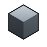
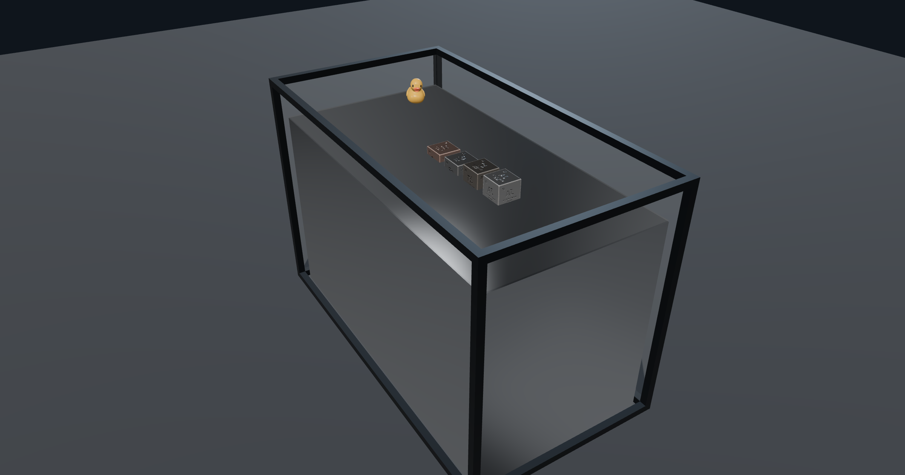

<div align="center">



# Dense

**A browser toy about how heavy things are.**

[](LICENSE)
[](https://threejs.org)
[](https://rapier.rs)
[](https://www.typescriptlang.org)
[](#how-it-is-tested)



</div>

---

Pick up a small metal cube. It weighs more than it has any right to. That surprise is the
whole point of this thing.

Dense gives you cubes of six metals — tungsten heavy alloy, gold, copper, iron, titanium
and aluminium — and four places to play with them. Nothing is animated. A cube's weight
comes from what it's made of and how big it is, and everything after that is a physics
engine working it out.

## The four rooms

**Sandbox.** Cubes, and five mats to drop them on. Two line-ups worth trying: six cubes
the same _size_, and six cubes the same _weight_. The second one is stranger — a kilo of
gold is visibly smaller than a kilo of aluminium.

**Weigh.** A digital scale and a balance. Put a gold cube on the scale, then a tungsten
cube the same size. The number barely moves. That near-match is exactly why gold-plated
tungsten is the classic way to fake a gold bar, and why your hand can't tell.

**Drop.** A six-floor tower and a winch. Choose a height, choose what's on the floor —
steel, oak, foam, a trampoline — and let go. Then start putting things underneath: an
egg, a wine glass, a watermelon, a soda can, a pane of glass, a plank across two cinder
blocks. What breaks and what survives is worked out, not scripted.

**Tank.** Water, honey, mercury. In water everything sinks, but at visibly different
speeds. Mercury is the good one: it's so heavy that four of the six metals _float_ on it,
each sitting at its own depth. Gold and tungsten don't — they sink, and they come apart
on the way down. Everywhere else in this toy those two are twins; the tank is the one
place you can see the difference.

## Where the numbers come from

Every density, sound and breaking point is a published figure, written down with its
source. Tungsten heavy alloy is 17.0–18.5 g/cm³ depending on purity, and the purity
slider really does change what a cube weighs. Mercury is 13,534 kg/m³, which is why the
line-up floats. A cube floats at exactly `its density ÷ the fluid's density` submerged —
that isn't a lookup table in the code, it's just what Archimedes says, and the app shows
you the result.

Where something is faked for the sake of being readable, the code says so out loud. Water
in a half-metre tank is really almost colourless; ours is tinted so you can tell there's
liquid in there.

## Running it

Node 22 and pnpm.

```bash
corepack enable
pnpm install
pnpm dev
```

Then open the address it prints. Each room has its own URL — `/`, `/weigh`, `/drop`,
`/tank` — so you can link straight to one.

## How it is tested

513 checks, in three groups:

|                     |                                                     |
| ------------------- | --------------------------------------------------- |
| `pnpm test`         | 201 unit tests — maths, formatting, state machines  |
| `pnpm test:physics` | 236 tests against the real physics engine, no mocks |
| `pnpm smoke`        | 76 browser tests across desktop, tablet and phone   |

The physics tests are the interesting ones. They don't check that the code does what it
did yesterday; they check it against numbers published before the code existed. The tank
reproduces its float depths — copper 66%, iron 58%, titanium 33%, aluminium 20% submerged
in mercury — because that's what the physics gives, not because anyone typed them in.

## Controls

Drag a cube to pick it up, if you're strong enough — there's a grip setting in the
toolbar and heavy cubes will beat one hand. Drag empty space to look around, scroll to
zoom. On a phone: one finger orbits, two fingers pinch and turn at once, three fingers
pan. Press and hold the floor to drop a new cube there. Everything is listed in the help
panel behind the **?**.

## Licence

MIT. See [LICENSE](LICENSE).

The rubber duck and several other models are third-party assets under their own licences;
attribution is recorded in the project docs.
